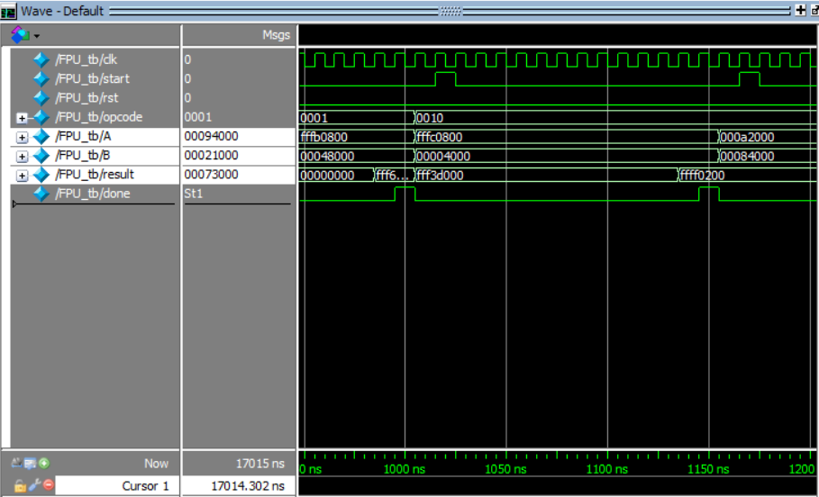
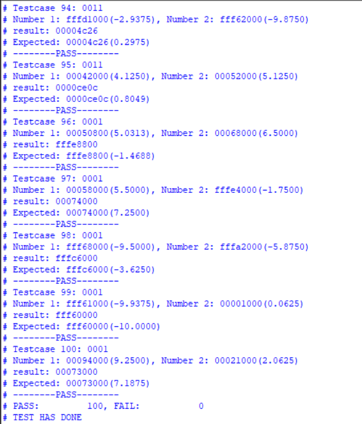

# Floating Point Unit
this is our project from verilog HDL class

FPU/
├── simulation/
│   └── modelsim/
│       └── testcase.txt
├── FPU.qpf
├── FPU.qsf
├── testcase.py
├── .gitignore
└── README.md

The project implements floating-point operations including addition, subtraction, multiplication, and division. 

The testbench verifies the module by reading test cases from `testcase.txt`.

The `testcase.txt` file is generated by `testcase.py`. You can modify this script to test specific operations.

## 📊 Waveform 

We tested our project with 100 randomly generated test cases.  
Each number is randomly chosen from the range **-10 to 10**, with fractional parts being powers of 2.

## 📄 Transcript

